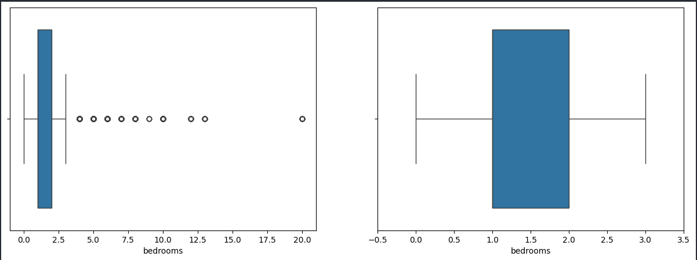
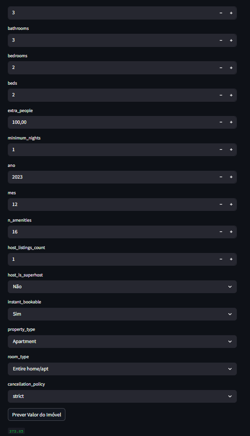

# Projeto de Ciência de Dados

## Projeto Airbnb Rio - Ferramenta de Previsão de Preço de Imóveis para pessoas comuns

## Criação:
**Autor:** Leonardo de Souza Silva  
**Data:** 10/04/2025  
**Atualização:**  ---

### Contexto

No Airbnb, qualquer pessoa que tenha um quarto ou um imóvel de qualquer tipo (apartamento, casa, chalé, pousada, etc.) pode ofertar o seu imóvel para ser alugado por diária.

Você cria o seu perfil de host (pessoa que disponibiliza um imóvel para aluguel por diária) e cria o anúncio do seu imóvel.

Nesse anúncio, o host deve descrever as características do imóvel da forma mais completa possível, de forma a ajudar os locadores/viajantes a escolherem o melhor imóvel para eles (e de forma a tornar o seu anúncio mais atrativo)

Existem dezenas de personalizações possíveis no seu anúncio, desde quantidade mínima de diária, preço, quantidade de quartos, até regras de cancelamento, taxa extra para hóspedes extras, exigência de verificação de identidade do locador, etc.

 

### Objetivo

Construir um modelo de previsão de preço que permita uma pessoa comum que possui um imóvel possa saber quanto deve cobrar pela diária do seu imóvel.

Ou ainda, para o locador comum, dado o imóvel que ele está buscando, ajudar a saber se aquele imóvel está com preço atrativo (abaixo da média para imóveis com as mesmas características) ou não.

 

### Fonte: 

Site Kaggle: https://www.kaggle.com/allanbruno/airbnb-rio-de-janeiro

 

### Regras Básicas de Negócios e Dicionário de Dados

- As bases de dados são os preços dos imóveis obtidos e suas respectivas características em cada mês.
- Os preços são dados em reais (R$)
- Temos bases de abril de 2018 a maio de 2020, com exceção de junho de 2018 que não possui base de dados

 

### Como Rodar
1. Clone o repositório
2. Baixe o dataset no site: https://www.kaggle.com/allanbruno/airbnb-rio-de-janeiro extraia os arquivos e coloque na pasta Dataset
2. Crie e ative um ambiente virtual
3. Instale as dependências com `pip install -r requirements.txt`
4. Crie um arquivo `.env` com as variáveis: usuario, senha, host, port, bd
5. Crie um arquivo `config.py` com os caminhos dos diretórios que serão usados
6. Rode o `config.py` para configurar os caminhos
7. Rode o `Tratativa_Dados.py` para tratativa básica de dados e carga no servidor
8. Rode o `Analise_Dados.py` para fazer análise dos dados e treinamento do modelo
9. Rode o `Deploy.py` para criação da página streamlit para deploy do nosso modelo

### Processos

#### Tratativa dos dados
- Como a base vem em múltiplas bases é feito uma rotina de repetição utilizando o pandas para concatenar os dados
- Após a junção dos dados é feito a exclusão de colunas que não serão usadas para criação do modelo. 
    * **Regras:** 
        * Id, url e informações não relevantes
        * Colunas repetidas ou extremamente parecidas(Que dão a mesma informação no modelo). Ex: Data x Ano/nes
        * Colunas preenchidas com texto livre pois não rodaremos nenhuma análise de palavras ou algo do tipo
        * Colunas que todos ou quase todos os valores são iguais
        * Colunas com quantidades de valores nulos acima de 300.000 linhas
    Colunas que ficarão ao final do processo aplicando as regras acima: colunas = ['host_is_superhost','host_listings_count','latitude','longitude','property_type','room_type','accommodates','bathrooms','bedrooms','beds','bed_type','amenities','price','guests_included','extra_people','minimum_nights','maximum_nights','number_of_reviews','instant_bookable','is_business_travel_ready','cancellation_policy','ano','mes']
- Visto que a quantidade de valores nulos é 2500 numa base de 900.000 é feito a exclusão dos dados nulos
- Feito a análise dos tipos de dados e a substituição dos valores string: '$' e ',' na coluna price e na coluna extra_people para poder convertê-la para o tipo float
- Convertido as colunas: host_listings_count, bathrooms, bedrooms, beds, guests_included, extra_people para int haja vista que estavam como float.

#### Carga no Banco de Dados
Após a tratativa básica é feito a carga da base para o servidor. O banco de dados utilizado é o postgresSQL porém o método utilizado pode ser feito em qualquer banco de dados SQL sendo importante denotar suas diferenças para conexão.

Para levar os dados para o servidor são utilizadas as bibliotecas sqlalchemy e psycopg2 para conectar ao servidor postgres. Também é utilizado a biblioteca dotenv para carregar os dados de conexão com o servidor de maneira mais segura evitando deixar os dados expostos no código.

**Etapas:**
- Carregar o dotenv com os dados da conexão
- atribuir às variáveis de conexão puxadas pelo dotenv
- criar a url de conexão com servidor utilizando as variáveis criadas
- criar a engine com a url de conexão
- inserir os dados de forma segura ao servidor através do método begin, commit se der certo e rollback se der errado e do to_sql do pandas.
- Para fazer a inserção dos dados mais rápido é utilizado o chunksize = 20
- Como a tabela não terá atualização de dados, é utilizado a condição dentro do to_Sql do if_exists='replace' para caso seja feito uma nova inserção sera feita a substituição dos dados da tabela pelos dados tratados novamente.

 

#### Análise dos dados

Para fazermos a análise dos dados, faremos a utilização da informação salva no servidor.

##### Etapas:
- Carregar o dotenv com os dados da conexão
- Atribuir as variáveis de conexão puxadas pelo dotenv
- Criar a url de conexão com servidor utilizando as variáveis criadas
- Criar a engine com a url de conexão
- Salvar query para puxar os dados em uma pasta para ser feito a leitura e ser fácil o manejo da mesma caso seja preciso atualização
- Ler a query salva através do método "with open" + o caminho do local onde foi salva a query.sql
- Fazer a conexão com o servidor utilizando a engine criada
- Utilizar o pandas para ler a query com read_sql_query
- analisar a correlação das colunas através de um mapa de calor. Para fazer essa análise faremos a correlação apenas das colunas numéricas
    * Conclusão: A correlação ainda está fraca. Após análise, podemos ver que a correlação mais forte está entre camas x quartos e quartos x banheiros chegando apenas à 69%
    

- Análise de outliers: Será feito análise das colunas continuas: price e extra_people
    * price: há valores acima de 1200 que podem afetar nossa análise pois como nosso objetivo é previsão de preço para pessoas comuns, esses valores muito acima não se enquadram e serão excluidos
    
    * extra_people: há valores acima de 1200 que podem afetar nossa análise pois como nosso objetivo é previsão de preço para pessoas comuns, esses valores muito acima não se enquadram e serão excluidos
    

- Análise dos números discretos: Será feito análise das colunas: host_listing_count, accommodates, bathrooms, bedrooms, beds, guests_included, minimum_nights, maximum_nights, number_of_reviews
    * host_listings_count: Após analise decidimos mante-la pois pode se tratar de imobiliaria
    
    * accomodates: há valores outliers que podem afetar nossa análise pois como nosso objetivo é previsão de preço para pessoas comuns, esses valores muito acima não se enquadram no perfil dos nossos clientes e serão excluidos
    
    * bathrooms: há valores outliers que podem distorcer nossa análise pois como nosso objetivo é previsão de preço para pessoas comuns, esses valores muito acima não se enquadram no perfil dos nossos clientes e serão excluidos
    
    * Bedrooms: há valores outliers que podem distorcer nossa análise pois como nosso objetivo é previsão de preço para pessoas comuns, esses valores muito acima não se enquadram no perfil dos nossos clientes e serão excluidos
    
    * beds: há valores outliers que podem distorcer nossa análise pois como nosso objetivo é previsão de preço para pessoas comuns, esses valores muito acima não se enquadram no perfil dos nossos clientes e serão excluidos
    
    * guests_included: os usuários do airbnb utilizam o valor 1 como padrão e isso pode tornar nossa análise não confiável, por isso os valores não são confiáveis e vamos excluí-la das nossas análises
    
    * minimum_nights: há valores outliers que podem distorcer nossa análise pois como nosso objetivo é previsão de preço para pessoas comuns, esses valores muito acima não se enquadram no perfil dos nossos clientes e serão excluidos
    
    * maximum_nights: os resultados estão extremamente espalhados tornando análise não confiável, por isso vamos excluí-la das nossas análises
    
    *number_of_reviews: os resultados estão extremamente espalhados tornando análise não confiável, por isso e vamos excluí-la das nossas análises
    

- Analise das features de texto: Vamos analisar as colunas de texto que são: property_type, room_type, bed_type, amenities, cancellation_policy 
    * property_type: os dados tem muitas categorias então agrupamos os dados menores que a quantidade é inferior a 2000 dados como o nome de outros
    * room_type: os dados estão bem distribuídos em apenas 4 colunas então não faremos alteração
    * bed_type: os dados estão distribuídos em 5 categorias sendo a categoria real_bed a possuidora de cerca de 95% dos dados e os outros 4 espalhados entre os demais. Não faremos alteração porém, pode ser testado depois transformar em apenas 2 categorias
    * cancellation_policy: Os dados estão distribuídos em 6 categorias, sendo as categorias: strict, super_strict_30 e super_strict_60 muito dispersas dos demais. Faremos o agrupamento deles em apenas strict
    * amenities: Como os dados dentro de cada linha são muito variados por se tratar das listas de comodidade disponíveis em cada anúncio, vamos criar uma coluna contando a quantidade de comodidades contidas nessas linhas
    * n_amenities: Após a criação dessa coluna ela torna-se uma feature de número discreto e se faz necessário análise. Como há valores outliers, faremos a exclusão dos mesmos

- Encoding: como ML só trabalha com variáveis numéricas, vamos fazer a conversão das colunas de texto para números e para isso seguiremos as seguintes regras para conversão: 
    * Features de apenas 2 categorias: tratar como True or False. 1 para True e 0 para False
        * Colunas: host_is_superhost, instant_bookable, is_business_travel_ready
    * Features de múltiplas categoria: criar variáveis Dummies
        * Colunas: property_type, room_type, bed_type, cancellation_policy

#### Machine Learning
Criação do modelo de previsão de preços. Para a criação utilizaremos mods de regressão

**Etapas:**
* Definição da variável que desejamos prever:  Price
* Modelos que serão utilizados: Random Forest, Linear Regression e Extra Trees
* Separação da quantidade de dados entre treino e teste(80% da quantidade para treino e 20% para teste)
* Rodar os 3 modelos escolhidos
* O modelo Extra Trees teve uma performance melhor que os demais modelos  

* Fazer melhorias no modelo escolhido (Extra Trees):
    * Análise de Features
    * is_business_travel_ready não parece afetar o nosso modelo e por isso faremos a exclusão dele do nosso modelo
    * number_of_reviews não parece afetar o nosso modelo e por isso faremos a exclusão dele do nosso modelo
    * bed_type parece não afetar o modelo e por isso faremos a exclusão de todas as colunas bed_type
    * Após exclusão das colunas, o modelo processa os dados mais rápido e sem perder desempenho
    
* Exportação do modelo para um arquivo joblib para utilização do modelo treinado

#### Deploy
Criação de uma página streamlit para deploy em produção

**Etapas:**
* Criação dos botões numéricos
    * Latitude e Longitude terão 5 casas decimais
    * extra_people terá 2 casas decimais
    * Demais não terão casas decimais
* Criação dos botões True or False recebendo os valores do nosso modelo: Sim = 1, Não = 0
* Criação dos botões de listas
* Criação do botão de previsão  

